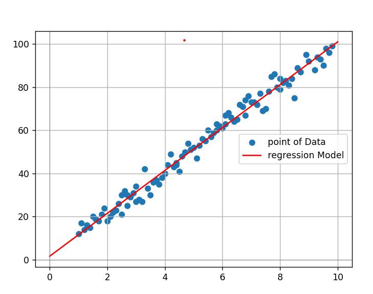
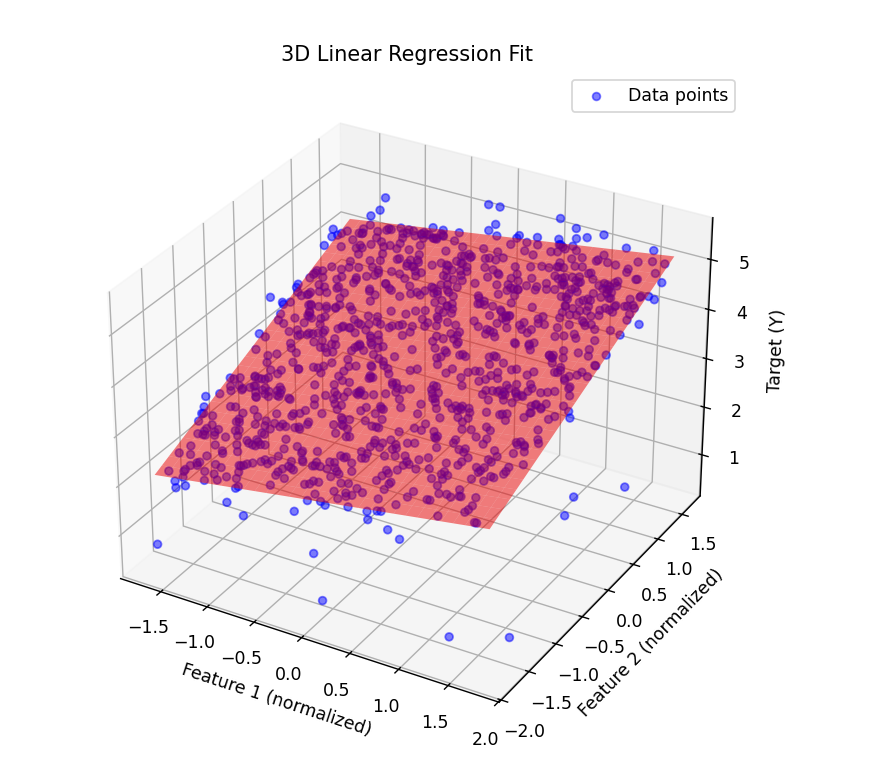

Absolutely! Here's a **more detailed and polished `README.md`**, complete with:

* Clear sectioning
* Technical breakdown
* Image placeholders (you just need to drop your screenshots in)
* Instructions for setup, usage, and learning goals

---

### 📄 `README.md`

```markdown
# 📈 Linear Regression from Scratch (1D & 3D)

This repository contains two educational Python projects that implement **Linear Regression from scratch** using **gradient descent**. These examples are fully manual — no external machine learning libraries like `scikit-learn` are used — to help you learn how regression and optimization actually work under the hood.

---

## 📌 Project Overview

| Project            | Type | Description                                      |
|--------------------|------|--------------------------------------------------|
| 1D Linear Regression | 🟦 Simple | Fits a line `Y = A * X + B` to 1D data from a CSV |
| 3D Linear Regression | 🟥 Multivariable | Fits a plane to synthetic 2D-feature data        |

---

## 📁 Folder Contents

```

.
├── 1d\_linear\_regression.py     # Simple 1D regression from CSV
├── 3d\_linear\_regression.py     # 2D feature regression with 3D plot
├── score.csv                   # Sample CSV file for 1D regression
├── 1d\_plot.png                 # Output screenshot (add yourself)
├── 3d\_plot.png                 # Output screenshot (add yourself)
└── README.md                   # You're reading it now!

````

---

## 🚀 1. 1D Linear Regression from CSV

### 📄 Description

This project loads a dataset from a CSV file (`score.csv`) and fits a linear model:

\[
Y = A \cdot X + B
\]

The gradient descent is implemented manually. You will see how the model converges over iterations to fit a line minimizing mean squared error.

### 🧠 Key Concepts
- Single-variable regression
- Manual computation of gradient descent
- Plotting model vs data

### 📦 Requirements
```bash
pip install numpy pandas matplotlib
````

### ▶️ How to Run

```bash
python 1d_linear_regression.py
```

### 📷 Output



---

## 🌐 2. 3D Linear Regression with Synthetic Data

### 📄 Description

This project:

* Generates **1000 synthetic 2D-feature data points** using a known linear equation
* Adds random noise to simulate real-world conditions
* Trains a linear model on this dataset using **gradient descent**
* Plots the regression **plane in 3D**

### 📈 Model

$$
Y = W_1 \cdot X_1 + W_2 \cdot X_2 + b
$$

Training is done on **normalized features** to ensure better convergence.

### 🧠 Key Concepts

* Multivariate regression (2 features)
* Synthetic data generation
* Feature normalization
* Manual loss minimization
* 3D visualization

### 📦 Requirements

```bash
pip install numpy matplotlib
```

### ▶️ How to Run

```bash
python 3d_linear_regression.py
```

### 📷 Output



---

## 🎯 Learning Goals

* Understand how gradient descent updates weights and bias
* Learn to normalize data for stable convergence
* Visualize regression lines and planes
* See the difference between 1D and multivariate regression
* Build everything **from scratch** without ML libraries

---

## 🧠 How Gradient Descent Works (Summary)

For both 1D and 3D versions, the model parameters (weights and bias) are updated using:

$$
W := W - \alpha \cdot \frac{\partial L}{\partial W}
\quad\quad
b := b - \alpha \cdot \frac{\partial L}{\partial b}
$$

Where:

* $L$ is the Mean Squared Error loss
* $\alpha$ is the learning rate

---

## 🧑‍💻 Author

**Yassine Ouali**
Passionate about AI, data, and building things from the ground up.

---

## ✅ License

This project is open-source for educational purposes. Feel free to use, modify, and learn from it.

---

## 💡 Want to go further?

Ideas to explore:

* Add a loss plot (loss vs. epochs)
* Try using polynomial features (nonlinear regression)
* Implement early stopping
* Compare with `scikit-learn`'s `LinearRegression`

---

```

---

### ✅ What You Need to Do

1. Place your screenshots in the same folder as:
   - `1d_plot.png`
   - `3d_plot.png`

2. Save this content into a `README.md` file.

3. That’s it — your project is now super clean and beginner-friendly!

Let me know if you want me to generate this as a file or turn it into a GitHub template!
```
